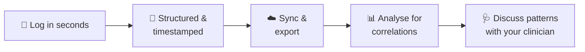

<div align="center">

#   Health Tracker

**Turn symptoms into structured data, so the patterns hiding behind them can finally be found.**

A mobile-first tracker that captures what you eat, how you feel, and everything around it: stress, sleep, meal size, timing, environment

<br>


[**Live Demo**](https://YOUR_USERNAME.github.io/gut-health-tracker/) · [**The Idea**](#-the-idea) · [**Features**](#-features) · [**Getting Started**](#-getting-started) · [**Roadmap**](#%EF%B8%8F-roadmap)

</div>


---

## 🎯 The Idea

Conditions like celiac disease and SIBO can remain undiagnosed for a long time, and many people live for years with symptoms that still have no clear explanation.

The problem is rarely a lack of advice. It's a **lack of good data**:

- Symptoms show up **hours or days** after the thing that caused them.
- Memory is unreliable, and appointments last minutes.
- The real driver is often not the food itself. It can be **how much** you ate, **when** you ate it, how **stressed** or **sleep-deprived** you were, the **weather**, or **where** the food was prepared.
- Most tracking apps record a few of these things. Almost none record them **together, consistently, in a form that can be analysed**.

**This app exists to solve the data problem first.** Every entry is timestamped, categorised and captured through fixed options and 1–10 scales instead of free-form notes. Over weeks and months that becomes a structured dataset you can analyse for **recurring correlations**, and one you can bring to a clinician as evidence instead of guesswork.



### Who it's for

- People with **celiac disease** tracking cross-contamination and hidden exposures
- People with **SIBO** or **IBS** looking for triggers and timing patterns
- People with **undiagnosed or unexplained** digestive symptoms who need data to support the conversation with their doctor
- Anyone running an elimination diet who wants to measure the results instead of guessing

---

## 🔍 What Gets Captured

Gut symptoms have many possible drivers. This app records the ones that usually get missed.

| The question | Where it's recorded |
| :-- | :-- |
| **What did I eat, and how much?** | **Food**: ingredients and brands, estimated grams/calories |
| **When did it happen?** | Timestamp on every entry, hours between last meal and sleep, exercise timing relative to meals, post-meal heart-rate window |
| **How did my gut respond?** | **Symptoms**: severity 1–10, persistence, duration. **Gut**: color, consistency, float/sink, smell, undigested food, gas |
| **How stressed was I?** | **Mental**: anxiety and anger/sadness on 1–10 scales, plus notes |
| **How did I sleep?** | **Sleep**: hours, quality 1–10, interruptions |
| **What was my body doing?** | **Vitals**, **Activity**, **Measures**: BP, heart rate, O₂, temperature, abdominal circumference, hydration |
| **What was going on around me?** | **Environment**: auto-fetched weather, season, exposure worries. **Food** also tracks location, cookware and washing soap |
| **What was I taking?** | **Meds / Supps**: name, dose, brand, reaction |
| **What's my medical context?** | **Tests & Timeline** and **Background** profile |

---

## ✨ Features

### 📝 Daily Log: 10 trackers, one tap each

| Tracker | What you can record |
| :-- | :-- |
| **Symptoms** | 35 preloaded symptoms across 8 body systems: upper GI, lower GI, heart, breathing, neurological, ears/mouth, muscle/nerve and general. Gut problems rarely stay in the gut, so heart, breathing and brain-fog symptoms are included. Rate severity **1–10** and mark persistence: *constant, comes and goes, one-off, worsening, improving* |
| **Food** | Ingredients and brands, cookware, location, washing soap, estimated grams/calories, hours until sleep, and contamination-worry notes |
| **Gut** | Bowel and gas events with duration, color, consistency, float/sink, smell, undigested food and unusual notes |
| **Vitals** | Blood pressure (sitting and standing), heart rate (resting, standing, post-meal, post-exercise recovery), rhythm, O₂, respiratory rate, temperature, blood sugar, grip strength |
| **Activity** | Type, duration, intensity, max weight lifted, timing relative to meals, activity-related symptoms, sun exposure |
| **Measures** | Weight, abdominal circumference (with context), water intake and type, urine color |
| **Mental** | Anxiety and anger/sadness on a 1–10 scale, plus notes |
| **Sleep** | Hours, quality (1–10), interruptions |
| **Meds / Supps** | Name, dose, brand and any noticed reaction |
| **Environment** | Season, weather, outdoor temperature, contamination and exposure worries |

### 🔬 Tests & Timeline
Keep every medical test in one chronological timeline: endoscopy, blood panels, breath tests, stool tests and more. Add the date, a long-form summary in a full-screen editor, and the filename of the related PDF or image so you always know which document belongs to which result.

### 👤 Background & Mission
A permanent profile with your diagnosis journey, your goals for tracking, and your past lifestyle context. Useful context for you, and for anyone analysing your data later.

### 🛠️ Built to fit *your* body
- **Editable libraries.** Add, edit, or delete your own symptoms and food items. **Long-press** any card to edit it.
- **Research notes.** Attach notes to each ingredient, brand, or cookware item, with `**bold**` text support.
- **Filter by category** in both the symptom and food pickers.

### ☁️ Sync & integrations
- **Google sign-in** with real-time Firestore sync across all your devices
- **Works without an account.** Data is stored locally in the browser first
- **Google Sheets sync.** Every entry is also appended to a spreadsheet of your choice
- **Telegram voice logging.** Send a voice note to your bot and it appears in your log, with an audio player
- **Auto weather.** Fetched from [Open-Meteo](https://open-meteo.com) (no API key) with one tap, or automatically the first time you log a symptom each day
- **CSV export.** One-tap download of your full history
- **Live stats.** Total entries, symptoms, meals and bowel events at a glance

---

## 📊 Built for Analysis

The point of the app is what you can do with the data afterwards. Today, your history is available as:

| Format | How |
| :-- | :-- |
| **CSV** | Tap **↓ CSV** in the header. Columns: `Date, Time, Category, Details, AudioLink` |
| **Google Sheets** | Live append of every new entry through Apps Script |
| **Firestore** | Your full dataset in your own Firebase project, ready for any script or pipeline |

Each entry's `Details` field is a simple `Field: value | Field: value` string, so it expands into one column per field in a few lines:

```python
import pandas as pd

df = pd.read_csv("export.csv")

# "Details" looks like: "Strength: 6/10 | Persistence: comes and goes | ..."
fields = df["Details"].str.split(" | ", regex=False).apply(
    lambda parts: dict(p.split(": ", 1) for p in parts if ": " in p)
)
df = df.join(pd.DataFrame(fields.tolist()))
```

From there you can look for things such as:

- Symptom severity in the hours after specific ingredients, brands or locations
- The effect of **meal size and timing** (for example, last meal versus sleep)
- Whether **stress or poor sleep** precedes flare-ups
- Links between **weather, season and environment** and symptoms
- Post-meal **heart-rate** changes versus GI symptoms
- Which foods, cookware or kitchens are consistently *safe*

---

## 🧱 Tech Stack

| Layer | Technology |
| :-- | :-- |
| Front end | Plain HTML, CSS and JavaScript in a single `index.html` |
| Auth | Firebase Authentication (Google provider) |
| Database | Cloud Firestore with a real-time `onSnapshot` listener |
| Offline cache | `localStorage` |
| Spreadsheet sync | Google Apps Script web app |
| Weather | Open-Meteo API |
| Voice logging | Telegram bot (bring your own backend, see below) |

---

## 🚀 Getting Started

### 1. Run it locally

```bash
git clone https://github.com/YOUR_USERNAME/gut-health-tracker.git
cd gut-health-tracker

# any static server works
npx serve .
# or
python3 -m http.server 8080
```

Open `http://localhost:8080`. Everything works locally out of the box. Sign-in and cloud sync need your own Firebase project (step 2).

### 2. Connect your own Firebase project

<details>
<summary><b>Click to expand</b></summary>

1. Create a project in the [Firebase Console](https://console.firebase.google.com).
2. Add a **Web app** and copy its config.
3. Enable **Authentication → Sign-in method → Google**.
4. Create a **Cloud Firestore** database.
5. Add your domain (for example `YOUR_USERNAME.github.io`) under **Authentication → Settings → Authorized domains**.
6. Replace the `firebaseConfig` object near the top of the `<script>` block in `index.html`:

```js
const firebaseConfig = {
  apiKey: "...",
  authDomain: "...",
  projectId: "...",
  storageBucket: "...",
  messagingSenderId: "...",
  appId: "..."
};
```

7. Lock down your data with the [security rules](#-privacy--security) below.

</details>

### 3. (Optional) Sync entries to Google Sheets

<details>
<summary><b>Click to expand</b></summary>

1. Create a Google Sheet and open **Extensions → Apps Script**.
2. Paste this script:

```js
function doPost(e) {
  const data = JSON.parse(e.postData.contents);
  SpreadsheetApp.getActiveSheet().appendRow([
    data.date, data.time, data.catLabel, data.content, data.audioUrl
  ]);
  return ContentService.createTextOutput("ok");
}
```

3. **Deploy → New deployment → Web app**, with access set to *Anyone*.
4. Copy the web app URL into `GOOGLE_SHEETS_WEB_APP_URL` in `index.html`.

</details>

### 4. (Optional) Enable Telegram voice logging

<details>
<summary><b>Click to expand</b></summary>

The app contains the **linking half** of this feature. The bot itself is a separate service that you host.

**In the app:** *Background → Link Telegram Account* generates a 5-digit code, stored in the `telegram_codes` Firestore collection with a 10-minute expiry. You then send `/start <code>` to your bot.

**Your bot needs to:**
1. Look up `telegram_codes/{code}` to map the Telegram chat to a `userId`.
2. Transcribe incoming voice notes (any speech-to-text or AI service).
3. Append an entry to `users/{userId}.logs` in this shape:

```json
{
  "id": 1700000000000,
  "date": "1/31/2026",
  "time": "08:15:00 AM",
  "cat": "food",
  "catLabel": "Food",
  "content": "Ingredients: potato, olive oil | Notes: ate at home",
  "audioUrl": "https://..."
}
```

The app listens to Firestore in real time, so the entry shows up instantly with an inline audio player.

</details>

### 5. Deploy to GitHub Pages

Go to **Settings → Pages**, choose your branch and the `/ (root)` folder, and save. Your app will be live at `https://YOUR_USERNAME.github.io/gut-health-tracker/`.

---

## 🗂️ Data Model

```
users/{userId}
 ├─ logs      [ { id, date, time, cat, catLabel, content, audioUrl? } ]
 ├─ tests     [ { id, name, date, summary, fileName } ]
 ├─ symptoms  [ { name, cat, desc } ]
 ├─ foods     [ { name, cat, desc } ]
 └─ bgInfo    { general, mission, lifestyle }

telegram_codes/{code}
 └─ { userId, createdAt, expiresAt }
```

---

## 🔒 Privacy & Security

This app handles **personal health data**, so treat your setup accordingly.

- **Your data, your project.** Everything is stored in *your* Firebase project and *your* Google Sheet. There is no third-party analytics or tracking.
- **Firebase web keys are not secrets**, but your **Firestore security rules are what protect the data**. Never leave the database in test mode. Recommended rules:

  ```
  rules_version = '2';
  service cloud.firestore {
    match /databases/{database}/documents {
      match /users/{userId} {
        allow read, write: if request.auth != null && request.auth.uid == userId;
      }
      match /telegram_codes/{code} {
        allow create: if request.auth != null
                      && request.resource.data.userId == request.auth.uid;
      }
    }
  }
  ```

  With these rules, cloud sync requires signing in. Signed-out use keeps working from `localStorage` only.
- **Keep your Apps Script URL private.** Anyone who has it can append rows to your sheet.
- **File attachments store the filename only**, not the file. This avoids browser storage limits and keeps documents out of the cloud.

---

## 🗺️ Roadmap

**Data foundation**
- [ ] Field-level storage, with one typed value per field instead of a combined `Details` string
- [ ] JSON export alongside CSV, with one column per field

**Analysis**
- [ ] Correlation explorer: symptom severity vs. food, meal size, timing, stress, sleep and weather
- [ ] Time-lag analysis: how many hours after a meal or ingredient symptoms appear
- [ ] Trigger and safe-food ranking across ingredients, brands, cookware and locations
- [ ] Trend charts and weekly summaries

**Sharing & access**
- [ ] Clinician-ready PDF report
- [ ] Installable PWA with offline support
- [ ] Multi-language support

---


## 🤝 Contributing

Ideas, bug reports and pull requests are welcome, especially around analysis methods and data structure. Open an issue to start a conversation.

## 📄 License

Released under the [MIT License](LICENSE).

<div align="center">
<br>

Made with 🌿 for everyone still looking for answers about their gut.

</div>
